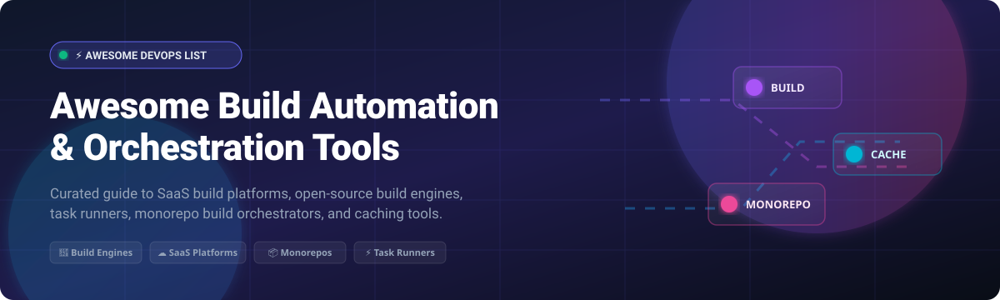

# ⚡ Awesome Build Automation Tool

  

     

**Curated Directory of Commercial SaaS Platforms &amp; Open-Source Build Automation Engines**

*Focused on Build Systems, Task Runners, Monorepo Orchestration, Remote Execution &amp; Build Caching*

📅 **Last updated: October 2026**

---

## 📌 Executive Summary &amp; Introduction

Welcome to **Awesome Build Automation Tool** — a comprehensive, SEO-optimized directory tracking leading **commercial SaaS platforms** and **open-source build automation tools**. Whether you are compiling C/C++ binaries, managing Java JVM dependencies, orchestrating large polyglot monorepos, or scaling CI/CD build runners in the cloud, this repository provides verified data on pricing, free tier limits, company valuation, and star ratings.

Build automation remains the backbone of modern Software Engineering and DevOps. Key industry pillars include **CMake** for cross-platform C/C++, **Bazel** and **Buck2** for hermetic monorepo builds, **Gradle** for Android and JVM applications, **Just** and **Task** for developer task automation, and cloud platforms like **CircleCI**, **AWS CodeBuild**, and **Google Cloud Build** for scalable continuous integration.

---

## 📑 Table of Contents

- [☁️ Commercial &amp; SaaS Build Tools](#️-commercial--saas-build-tools)
- [🔓 Open-Source GitHub Projects](#-open-source-github-projects)
- [🧩 Category Breakdown &amp; Recommendations](#-category-breakdown--recommendations)
- [🤝 How to Contribute](#-how-to-contribute)
- [⚠️ Disclaimer](#️-disclaimer)
- [💖 Support &amp; Community](#-support--community)
- [📈 Star History](#-star-history)

---

## ☁️ Commercial &amp; SaaS Build Tools

> 💡 **Market Overview &amp; Industry Dynamics**: The global Build Automation &amp; Continuous Integration Market is estimated at **$1.8 Billion – $2.5 Billion** and projected to grow beyond $5.0 Billion by 2030. The sector is **moderately fragmented** — dominated by hyper-scale public cloud providers (Microsoft, AWS, Google Cloud) offering bundled build infrastructure alongside specialized DevOps SaaS platforms (CircleCI, Bitrise, Semaphore) and enterprise build acceleration systems.

*The table below compares major Commercial &amp; SaaS build automation platforms, sorted descending by **Company Size / Valuation**.*

| Tool 🛠️ | Company Size / Valuation 🏢 | Key Features &amp; Best For 🎯 | Starting Tier Pricing 💰 | Free Tier Limit 🎁 |
|---|---|---|---|---|
| **[Microsoft Build Engine (MSBuild)](https://github.com/dotnet/msbuild)** | `~$3.1 Trillion Market Cap` (Microsoft) | XML-based build platform (`.csproj`, `.vbproj`) with targets, tasks, and parallel build support. *Best for .NET applications and Visual Studio integration.* | `$0` (Free &amp; Open Source) | `Unlimited (Fully free MIT open-source software)` |
| **[AWS CodeBuild](https://aws.amazon.com/codebuild/)** | `~$2.3 Trillion Market Cap` (Amazon / AWS) | Fully managed build service that compiles source code, runs unit tests, and produces deployable artifacts. *Best for AWS-native build pipelines.* | `$0.005 per build minute` (EC2 `general1.small`) | `100 build mins/month (EC2 general1.small) + 6,000 build secs/month (Lambda)` |
| **[Google Cloud Build](https://cloud.google.com/build)** | `~$2.1 Trillion Market Cap` (Alphabet / GCP) | Serverless build platform executing builds on GCP infrastructure with native Docker and Artifact Registry integration. *Best for GCP container builds.* | `$0.006 per build minute` (`e2-standard-2`) | `2,500 build minutes/month (e2-standard-2)` |
| **[Travis CI](https://www.travis-ci.com/)** | `~$3.0 Billion Valuation` (Idera Inc.) | Multi-language build runner with matrix build configurations and automated deployment integrations. *Best for open-source and cross-platform builds.* | `$15/month` (Starting usage-based tier) | `10,000 build credits free trial (one-time trial allotment)` |
| **[CircleCI](https://circleci.com/)** | `~$1.7 Billion Valuation` | Native Docker support, orb ecosystem, parallel test execution, and custom runner configurations. *Best for polyglot CI/CD build automation.* | `$15/month` (Performance Plan) | `30,000 credits/month (~3,000 build mins on Linux Medium)` |
| **[Bitrise](https://bitrise.io/)** | `~$250 Million Valuation` | Mobile-focused build automation and CI/CD with 300+ pre-built steps for iOS and Android workflows. *Best for mobile app build automation.* | `$89/month` (Starter Plan) | `300 credits/month (1 private app, 5 concurrencies, 90-min timeout)` |
| **[Semaphore CI](https://semaphoreci.com/)** | `~$25 Million Valuation` (Rendered Text) | High-performance programmable CI/CD platform with automatic test profiling and cloud/self-hosted agents. *Best for fast parallel build pipelines.* | `$0.0075 per build minute` (Ubuntu x64 2-vCPU) | `$15 free credits/month (~2,000 build mins on Ubuntu 2-vCPU)` |

---

## 🔓 Open-Source GitHub Projects

Build automation features one of the most mature open-source ecosystems in software engineering. Below is a curated list of leading open-source build engines, task runners, and monorepo build orchestrators, sorted descending by **GitHub_Stars_Count**.

| Rank | Tool 🛠️ | GitHub_Stars_Count Badge ⭐ | License 📜 | Key Features &amp; Best For 🎯 |
|:---:|---|:---:|:---:|---|
| 1 | **[Just](https://github.com/casey/just)** |  | `CC0-1.0` | Handy command runner for project-specific commands without Makefile complexity. *Best for modern task running.* |
| 2 | **[Bazel](https://github.com/bazelbuild/bazel)** |  | `Apache-2.0` | Google's hermetic, reproducible monorepo build system with remote caching &amp; execution. *Best for multi-language monorepos.* |
| 3 | **[Gradle](https://github.com/gradle/gradle)** |  | `Apache-2.0` | Groovy/Kotlin DSL build tool with incremental builds, build cache, and rich plugin ecosystem. *Best for Android &amp; JVM projects.* |
| 4 | **[Task (Taskfile)](https://github.com/go-task/task)** |  | `MIT` | Go-based task runner / build tool using simple YAML `Taskfile.yml`. *Best for simple cross-platform developer task automation.* |
| 5 | **[Ninja](https://github.com/ninja-build/ninja)** |  | `Apache-2.0` | Small, ultra-fast build system focused on execution speed, designed for machine generation. *Best for large C/C++ builds.* |
| 6 | **[xmake](https://github.com/xmake-io/xmake)** |  | `Apache-2.0` | Lightweight Lua-based C/C++ build utility with integrated package management. *Best for modern C/C++ cross-platform builds.* |
| 7 | **[Earthly](https://github.com/earthly/earthly)** |  | `BSL-1.1 / Apache-2.0` | Containerized build automation tool combining syntax of Makefile and Dockerfile. *Best for reproducible Docker-based builds.* |
| 8 | **[CMake](https://github.com/Kitware/CMake)** |  | `BSD-3-Clause` | The de facto cross-platform build system generator producing Makefiles, Ninja files, and VS solutions. *Best for C/C++ projects.* |
| 9 | **[MSBuild](https://github.com/dotnet/msbuild)** |  | `MIT` | Microsoft's XML-based build engine powering .NET and Visual Studio projects (`.csproj`, `.vbproj`). *Best for .NET applications.* |
| 10 | **[Meson](https://github.com/mesonbuild/meson)** |  | `Apache-2.0` | Modern, fast build system using Python-like syntax, targeting Ninja generators. *Best for modern C/C++ &amp; polyglot software.* |
| 11 | **[Buck2](https://github.com/facebook/buck2)** |  | `Apache-2.0` | Meta's high-performance Rust-based monorepo build system with Starlark DSL and hermetic rules. *Best for large polyglot monorepos.* |
| 12 | **[Apache Maven](https://github.com/apache/maven)** |  | `Apache-2.0` | Java enterprise standard utilizing Project Object Model (POM) XML with standard build lifecycles. *Best for Java enterprise projects.* |
| 13 | **[Pants](https://github.com/pantsbuild/pants)** |  | `Apache-2.0` | Fast, scalable build system with dependency inference and remote caching. *Best for Python, Go, Java, &amp; Shell monorepos.* |
| 14 | **[Please](https://github.com/thought-machine/please)** |  | `Apache-2.0` | High-performance Go-based build system providing Bazel-like hermeticity with simpler configuration. *Best for polyglot repos.* |
| 15 | **[GNU Make](https://www.gnu.org/software/make/)** |  | `GPL-3.0` | The classic universal build tool used for over 40 years across Unix and Linux ecosystems. *Best for system software &amp; Makefiles.* |
| 16 | **[Apache Ant](https://github.com/apache/ant)** |  | `Apache-2.0` | Flexible XML-based Java build tool for target and task automation. *Best for legacy Java projects.* |

---

## 🧩 Category Breakdown &amp; Recommendations

- **Universal &amp; C/C++ Builds**: Pair **CMake** or **Meson** with **Ninja** for lightning-fast compilation.
- **JVM &amp; Mobile Apps**: Use **Gradle** for Android/Kotlin projects and **Apache Maven** for enterprise Java.
- **Monorepo Build Orchestration**: Choose **Bazel** or **Buck2** for hermetic, multi-language scale with remote caching. Use **Pants** for Python-centric monorepos.
- **Task Automation**: Use **Just** or **Task (Taskfile)** as modern, user-friendly alternatives to Makefiles.
- **SaaS CI/CD Integration**: Connect **CircleCI**, **AWS CodeBuild**, or **Google Cloud Build** for managed cloud pipelines.

---

## 🤝 How to Contribute

Contributions are welcome! Please follow these guidelines:

1. Fork the repository on GitHub.
2. Add or update tool details in `README.md` following the exact table structure.
3. Include verified pricing, free tier limits, Stars_Badges, and official links.
4. Submit a Pull Request with a short summary of changes.

---

## ⚠️ Disclaimer

- This is a community-curated list for informational purposes.
- Build automation tools execute arbitrary code during compilation; ensure sandboxing, supply chain verification, and organizational security compliance.

---

## 💖 Support &amp; Community

Thank you for visiting and supporting **Awesome Build Automation Tool**! 🚀

If you find this repository helpful, please consider:
- 🌟 **Starring** this repository to help others discover it!
- 🔀 **Forking** it to add your favorite build tools or fixes.
- 📢 **Sharing** it with fellow software engineers, DevOps practitioners, and build engineers!
- ☕ **Sponsoring / Buying a Coffee**: Support ongoing open-source maintenance via [GitHub Sponsors](https://github.com/sponsors/ishandutta2007).

---

## 📈 Star History

